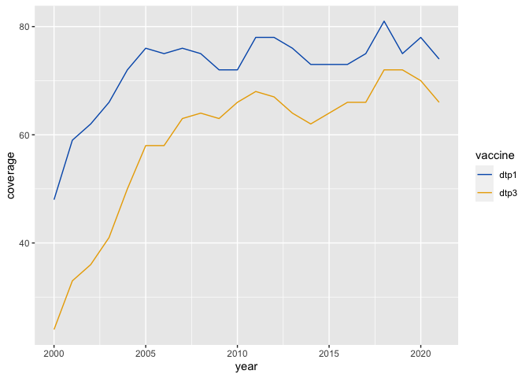

<!-- README.md is generated from README.Rmd. Please edit that file -->

# gavir

<!-- badges: start -->
<!-- badges: end -->

This package is a hodge podge of helper functions that can be used at
Gavi. It mainly has functions to help simplify repeat procedures, like
functions to add Gavi colors to plots.

## Installation

You can install the development version of gavir from
[GitHub](https://github.com/) with:

``` r
# install.packages("devtools")
devtools::install_github("joshualorin/gavir")
```

## Example

This is a basic example which shows you how to solve a common problem:

``` r
library(gavir)
library(tidyverse)
#> ── Attaching packages ─────────────────────────────────────── tidyverse 1.3.2 ──
#> ✔ ggplot2 3.3.6      ✔ purrr   0.3.4 
#> ✔ tibble  3.1.8      ✔ dplyr   1.0.10
#> ✔ tidyr   1.2.0      ✔ stringr 1.4.1 
#> ✔ readr   2.1.2      ✔ forcats 0.5.2 
#> ── Conflicts ────────────────────────────────────────── tidyverse_conflicts() ──
#> ✖ dplyr::filter() masks stats::filter()
#> ✖ dplyr::lag()    masks stats::lag()
## basic example code

wuenic %>%
 filter(iso3 == "AFG" & vaccine %in% c("dtp1", "dtp3")) %>%
 ggplot(aes(year, coverage, color = vaccine)) +
 geom_line() +
 scale_color_gavi()
```


