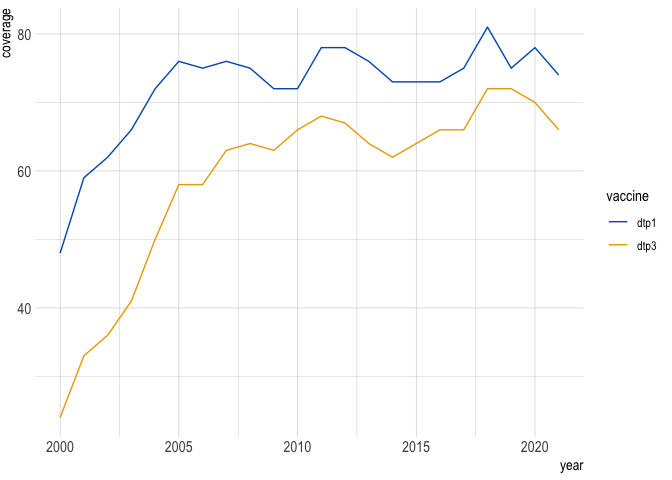

<!-- README.md is generated from README.Rmd. Please edit that file -->

# gavir

<!-- badges: start -->
<!-- badges: end -->

This package is a suite of helper functions that can be used at Gavi. It
mainly has functions to help simplify repeat procedures, like loading
common data, gavi specific colors and themes for plots and tables, and
functions which add and filter common varibles like country groupings
and iso3 codes.

## Installation

You can install the development version of gavir from
[GitHub](https://github.com/) with:

``` r
# install.packages("devtools")
devtools::install_github("joshualorin/gavir")
```

## Examples

You can use the `get_*()` functions to load data:

``` r
library(gavir)
library(tidyverse, warn.conflicts = F, verbose = F)
#> ── Attaching packages ─────────────────────────────────────── tidyverse 1.3.2 ──
#> ✔ ggplot2 3.4.2      ✔ purrr   0.3.4 
#> ✔ tibble  3.1.8      ✔ dplyr   1.0.10
#> ✔ tidyr   1.2.0      ✔ stringr 1.5.0 
#> ✔ readr   2.1.3      ✔ forcats 0.5.2 
#> ── Conflicts ────────────────────────────────────────── tidyverse_conflicts() ──
#> ✖ dplyr::filter() masks stats::filter()
#> ✖ dplyr::lag()    masks stats::lag()

# all functions require a version date
get_groupings("2023-07")
#> Reading in groupings file dated: 2023-07
#> Interesting! The groupings file you have selected is not the most recent. If this was unintentional, you can update to the most recent file, which is 2023-08
#> # A tibble: 196 × 61
#>    iso3  iso3_num iso2  country count…¹ lang  global gavi77 gavi73 gavi72 gavi68
#>    <chr>    <dbl> <chr> <chr>   <chr>   <chr>  <dbl>  <dbl>  <dbl>  <dbl>  <dbl>
#>  1 AFG          4 AF    Afghan… Afghan… eng        1      1      1      1      1
#>  2 AGO         24 AO    Angola  Angola  eng        1      1      1      1      1
#>  3 ALB          8 AL    Albania Albania eng        1      1      0      0      0
#>  4 AND         20 AD    Andorra Andorra eng        1      0      0      0      0
#>  5 ARE        784 AE    United… United… eng        1      0      0      0      0
#>  6 ARG         32 AR    Argent… Argent… eng        1      0      0      0      0
#>  7 ARM         51 AM    Armenia Armenia eng        1      1      1      1      1
#>  8 ATG         28 AG    Antigu… Antigu… eng        1      0      0      0      0
#>  9 AUS         36 AU    Austra… Austra… eng        1      0      0      0      0
#> 10 AUT         40 AT    Austria Austria eng        1      0      0      0      0
#> # … with 186 more rows, 50 more variables: gavi57 <dbl>, gavi55 <dbl>,
#> #   mics45 <dbl>, dov96 <dbl>, vimc112 <dbl>, who_region <chr>,
#> #   gavi_region <chr>, gavi_region_short <chr>, pef_type <chr>,
#> #   continental_africa <dbl>, francophone <chr>, indo_pacific <dbl>,
#> #   regional_je <dbl>, regional_mena <dbl>, regional_yfv_2016 <dbl>,
#> #   regional_yfv_2020 <dbl>, regional_ipv <dbl>, segments_2020 <chr>,
#> #   segments_2021 <chr>, segments_2022 <chr>, segments_2023 <chr>, …

# and most have additional parameters you can fiddle with
get_ihme("2023-02", source = "subnational", vaccine = "dtp3")
#> Reading in Subnational IHME file dated 2023-02 and aggregated to polio shapes
#> Rows: 1217964 Columns: 17── Column specification ────────────────────────────────────────────────────────
#> Delimiter: ","
#> chr (8): iso3, admin2, admin2_code, vaccine, admin1, admin1_code, pop_model,...
#> dbl (9): year, coverage, pu1_final, unvax_total, pct_unvax, upper, lower, pu...
#> ℹ Use `spec()` to retrieve the full column specification for this data.
#> ℹ Specify the column types or set `show_col_types = FALSE` to quiet this message.
#> # A tibble: 1,217,964 × 17
#>    iso3  admin2     admin…¹  year vaccine cover…² pu1_f…³ unvax…⁴ pct_u…⁵ admin1
#>    <chr> <chr>      <chr>   <dbl> <chr>     <dbl>   <dbl>   <dbl>   <dbl> <chr> 
#>  1 ETH   MAO KOMO … {00061…  2000 dtp1      0.293   1723.   1218.   0.707 BENES…
#>  2 ETH   MAO KOMO … {00061…  2001 dtp1      0.430   1760.   1003.   0.570 BENES…
#>  3 ETH   MAO KOMO … {00061…  2002 dtp1      0.413   1792.   1052.   0.587 BENES…
#>  4 ETH   MAO KOMO … {00061…  2003 dtp1      0.377   1807.   1126.   0.623 BENES…
#>  5 ETH   MAO KOMO … {00061…  2004 dtp1      0.448   1846.   1019.   0.552 BENES…
#>  6 ETH   MAO KOMO … {00061…  2005 dtp1      0.536   1885.    874.   0.464 BENES…
#>  7 ETH   MAO KOMO … {00061…  2006 dtp1      0.617   1906.    730.   0.383 BENES…
#>  8 ETH   MAO KOMO … {00061…  2007 dtp1      0.671   1931.    636.   0.329 BENES…
#>  9 ETH   MAO KOMO … {00061…  2008 dtp1      0.723   1955.    542.   0.277 BENES…
#> 10 ETH   MAO KOMO … {00061…  2009 dtp1      0.747   1958.    496.   0.253 BENES…
#> # … with 1,217,954 more rows, 7 more variables: admin1_code <chr>,
#> #   pop_model <chr>, pop_adjustment <chr>, upper <dbl>, lower <dbl>,
#> #   pu1_uncalib <dbl>, pu1_calib <dbl>, and abbreviated variable names
#> #   ¹​admin2_code, ²​coverage, ³​pu1_final, ⁴​unvax_total, ⁵​pct_unvax
```

`theme_*()` and `scale_*()` functions allow for standard gavi formatting
and colors:

``` r

wuenic %>%
 filter(iso3 == "AFG" & vaccine %in% c("dtp1", "dtp3")) %>%
 ggplot(aes(year, coverage, color = vaccine)) +
 geom_line() +
 scale_color_gavi() + 
 theme_gavi()
```


